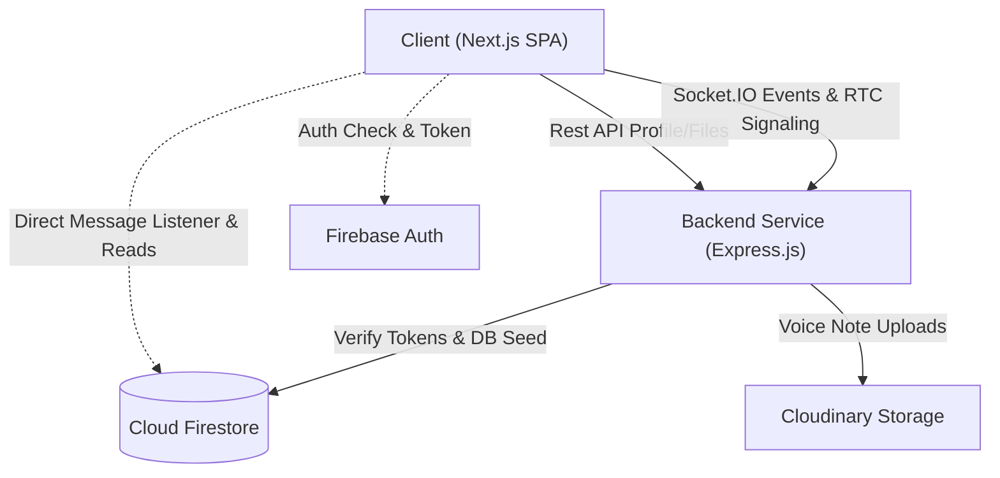
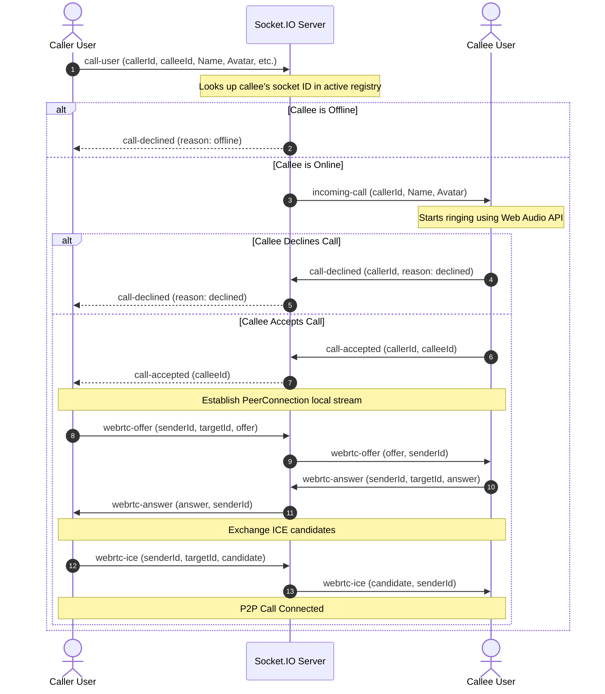

# NSGram Architecture Design

This document details the system design, context topologies, and WebRTC call logic underlying the NSGram real-time platform.

---

## 🏛️ Overall System Topology

NSGram operates as a decoupled client-server architecture with state synchronization handled by Firebase and real-time signalling/events managed via WebSockets (Socket.IO).

---

## 🧭 Client State & Context Layout

The frontend states are orchestrated under the `NsgramAuthProvider` Context located in [`frontend/src/components/nsgram/NsgramAuthProvider.tsx`](file:///c:/Users/sunil/OneDrive/Desktop/HIII-Nishant/frontend/src/components/nsgram/NsgramAuthProvider.tsx).

- **Authentication Watcher:** Automatically hooks into Firebase `onAuthStateChanged`.
- **User Document Subscription:** Subscribes to the specific Firestore user profile document via `onSnapshot` when authenticated.
- **Active Directory Watcher:** Fetches and filters active users lists to populate the messaging searches.
- **Socket Manager:** Instantiates a Socket.IO client connection when a profile is fetched, registering the socket to enable calling and message receipts.

---

## 📞 WebRTC Calls Flow Diagram

WebRTC voice/video calls utilize Socket.IO as the signaling channel, bypassing database writes to keep latency at a minimum. Peer connections are handled in [`frontend/src/components/nsgram/useVoiceCall.ts`](file:///c:/Users/sunil/OneDrive/Desktop/HIII-Nishant/frontend/src/components/nsgram/useVoiceCall.ts).

